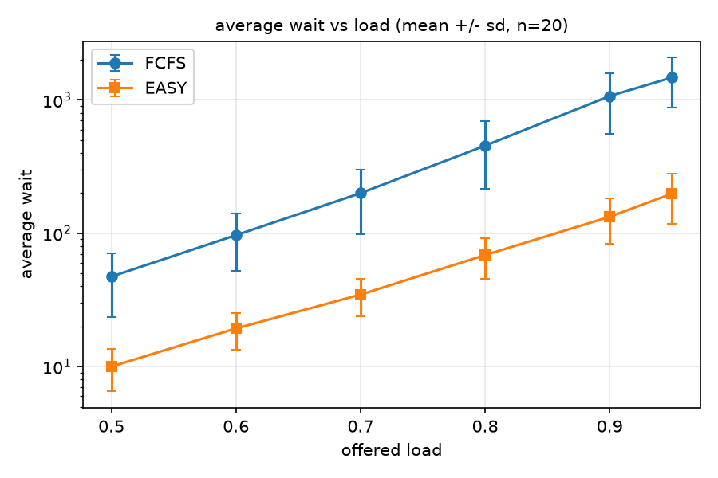
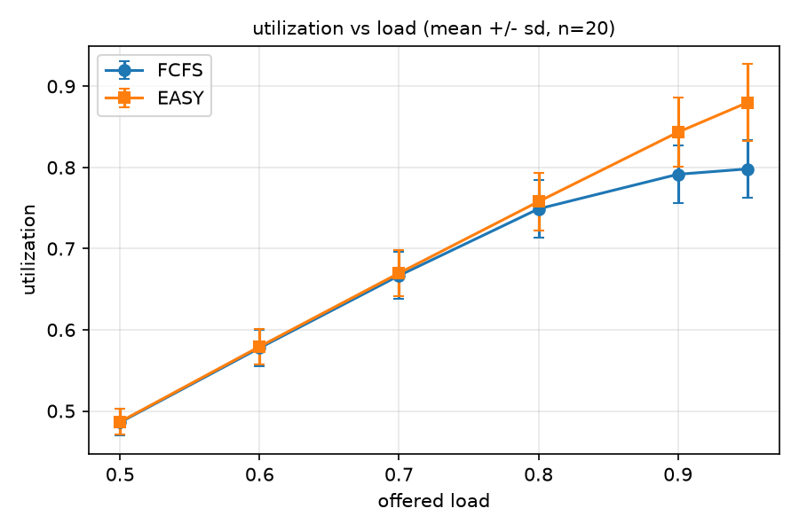
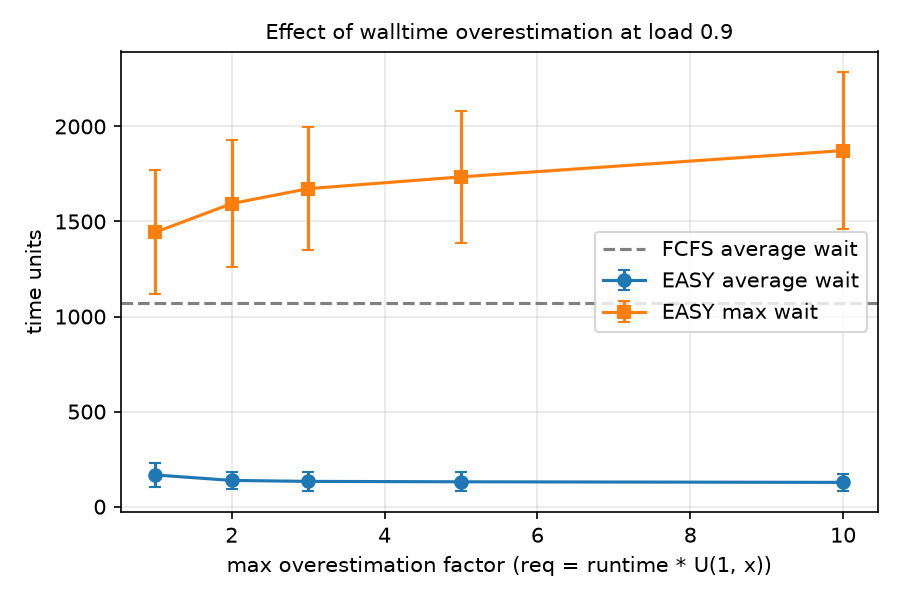

# Batch-scheduler simulator: FCFS vs EASY backfilling

A small C++17 discrete-event simulator of an HPC batch scheduler. Jobs request several
cores and a walltime, and the scheduler decides when each one starts. I compare strict
FCFS with EASY backfilling and study how users' walltime overestimation affects
backfilling.

## Run it

```
python benchmarks/run.py          # compile, verify, sweep, benchmark, plot (needs g++, Python, matplotlib)
```

or by hand: `g++ -O2 -std=c++17 -o sim src/sim.cpp && ./sim demo`

Outputs go to `results/` (`results.csv`, `summary.txt`, `*.png`).

## Model

- Cluster of 64 identical cores. Jobs are *rigid*: all requested cores are needed at once.
- Each job has an actual runtime and a requested walltime (`req = runtime * U(1, x)`).
  The scheduler only sees `req`; the simulation ends jobs at the actual runtime.
- Synthetic workload: log-normal runtimes, core counts 1-32 (skewed to small), Poisson
  arrivals scaled to a target offered load. Seeds are fixed, so runs are reproducible.
- **FCFS:** start the head of the queue while it fits; never look past it.
- **EASY backfilling:** if the head job is blocked, compute its promised start (the
  *shadow time*, from the running jobs' requested end times) and the cores spare at that
  moment. A later job may start now if it fits in the free cores and either finishes (by
  its request) before the shadow time, or uses only the spare cores. The head job is never
  delayed.
- Metrics: average wait, maximum wait, bounded slowdown (threshold 10), utilization.

## Verification

`./sim demo` runs a 3-job, 8-core example I worked out by hand. Expected and observed:
FCFS average wait 5.67 (waits 0, 9, 8) and EASY 3.00 (waits 0, 9, 0; job C backfills at
t=2). Utilization is 71.7% in both because the makespan is set by job B in both cases.

## Results

At offered load 0.9 with overestimation up to 3x (20 replications, 2000 jobs each; see
`results/summary.txt` for the exact numbers):

- EASY cut average wait by 88% relative to FCFS (1070 to 133 time units).
- Utilization rose from 79.2% to 84.3%.
- Maximum wait was lower under EASY in this workload (2360 vs 1673).




**Overestimation.** The scheduler plans with requested walltimes, so I varied how
inflated they are. FCFS is unaffected (it ignores them). For EASY at load 0.9, average
wait stayed roughly flat to slightly better as the inflation grew (167 at 1x to
128 at 10x), while maximum wait grew (1443 to 1873). I have not tested why;
a plausible explanation is that inflated requests make the shadow time later, which
gives more jobs room to backfill but leaves the longest-waiting jobs waiting longer.



## Limitations

- Non-preemptive; rigid jobs only; no memory, I/O, network, or GPU modelling.
- The sweep runs single-threaded in the version I tested; src/sim.cpp supports
  multi-threading on toolchains with std::thread.
- Synthetic workload, not a real trace. Absolute numbers are not predictions for any real
  cluster; only the comparisons between policies are meaningful.
- Statistics are over 20 seeds per setting. Results include start-up and drain phases
  (the first and last jobs), which I did not trim.
- Only one backfilling variant (EASY); no conservative backfilling.

## Possible extensions

Replay a real trace (Standard Workload Format from the Parallel Workloads Archive);
add conservative backfilling; add a fair-share priority.
